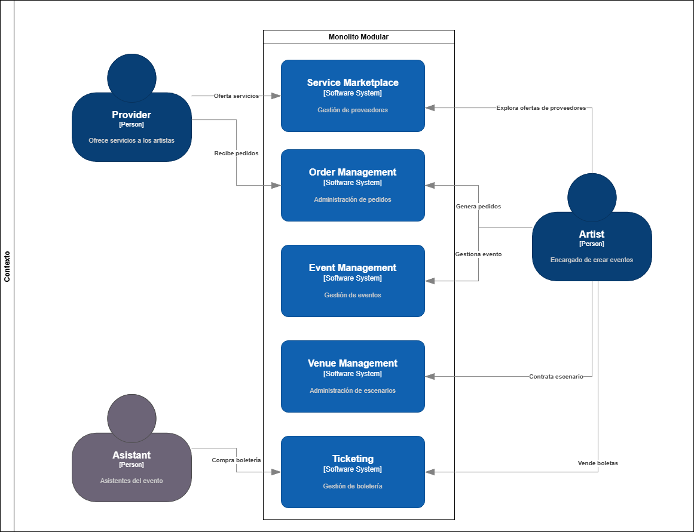

# Repositorio Backend | Reto: Gestión de eventos culturales

## Tabla de contenidos

- [Descripción del reto](#descripción-del-reto)
- [Estilo de arquitectura](#estilo-de-arquitectura)
- [Justificación de la elección de la arquitectura](#justificación-de-la-elección-de-la-arquitectura)
- [Tecnologías utilizadas](#tecnologías-utilizadas)
- [Diagrama de contexto](#diagrama-de-contexto)

## Descripción del reto

En Medellín, muchos artistas independientes enfrentan dificultades para organizar presentaciones, ya que deben coordinar múltiples actores (sonido, transporte, equipos, personal), en procesos informales y fragmentados que limitan su circulación.

El reto es crear una plataforma que permita a los artistas independientes coordinar de manera eficiente los recursos y actores necesarios para organizar sus presentaciones en la ciudad.

## Estilo de arquitectura

El proyecto se implementará utilizando un estilo de arquitectura monolítica con estructura modular. Esto significa que todas las funcionalidades estarán contenidas en una sola aplicación, pero se organizarán en módulos para mantener el código limpio y fácil de mantener.

La comunicación interna entre los módulos se realizará a través de un sistema de eventos o mensajes, lo que permitirá una mayor flexibilidad y desacoplamiento entre las diferentes partes de la aplicación. Esto facilitará la escalabilidad y el mantenimiento a largo plazo del proyecto.

Se aplicará la arquitectura de capas verticales (Vertical Slice Architecture), donde cada módulo se encargará de una funcionalidad específica y tendrá sus propias capas de presentación, lógica de negocio y acceso a datos. Esto permitirá una mayor cohesión dentro de cada módulo y reducirá las dependencias entre ellos.

## Justificación de la elección de la arquitectura

- **Monolito con estructura modular**: Esta arquitectura es adecuada para proyectos de tamaño pequeño a mediano, donde la complejidad no justifica la necesidad de una arquitectura distribuida. Permite un desarrollo más rápido y una gestión más sencilla de las dependencias entre módulos. Además, facilita la implementación de nuevas funcionalidades sin afectar el resto del sistema, ya que cada módulo puede desarrollarse y probarse de manera independiente. Un monolito modular también es más fácil de desplegar y mantener en comparación con arquitecturas más complejas como microservicios, especialmente para equipos pequeños o con recursos limitados.

- **Comunicación interna mediante eventos o mensajes**: Este enfoque permite una mayor flexibilidad y desacoplamiento entre los módulos, lo que facilita la escalabilidad y el mantenimiento a largo plazo del proyecto. Al utilizar eventos o mensajes para la comunicación interna, se reduce la dependencia directa entre los módulos, lo que permite que cada módulo evolucione de manera independiente sin afectar a los demás. Esto también facilita la implementación de nuevas funcionalidades y la resolución de problemas, ya que los cambios en un módulo no tendrán un impacto directo en el resto del sistema.

- **Arquitectura de capas verticales**: Esta arquitectura permite una mayor cohesión dentro de cada módulo y reduce las dependencias entre ellos. Al organizar el código en capas verticales, se mejora la separación de responsabilidades y se facilita la comprensión del código. Cada módulo puede tener su propia capa de presentación, lógica de negocio y acceso a datos, lo que permite un desarrollo más organizado y una mejor gestión de las dependencias. Además, esta arquitectura facilita la implementación de nuevas funcionalidades y la resolución de problemas, ya que cada módulo puede desarrollarse y probarse de manera independiente.

**NOTA**: Con este enfoque arquitectónico, se busca crear una plataforma robusta y escalable. Además, si en un futuro se requiere, se podría migrar a una arquitectura de microservicios sin necesidad de reescribir toda la aplicación, ya que los módulos ya estarán desacoplados y comunicándose a través de eventos o mensajes.

## Tecnologías utilizadas

- **.NET 10**
- **Entity Framework**
- **PostgreSQL**
- **Docker**
- **OpenAPI**

## Diagrama de contexto

