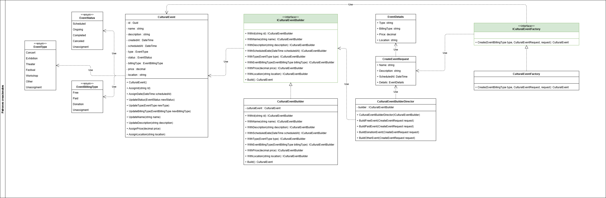

# Aplicación de patrones de diseño

En esta sección se describen los patrones de diseño que se han aplicado en el proyecto, así como las razones por las cuales se han elegido dichos patrones y cómo se han implementado en el código.

## Patrones de diseño creacionales aplicados

- **Builder**: El patrón Builder se ha aplicado dentro del desarrollo para la construcción del objeto `CulturalEvent`, el cual tiene una gran cantidad de propiedades, algunas de las cuales son opcionales. El uso del patrón Builder permite una construcción más flexible y legible del objeto, evitando la necesidad de tener múltiples constructores o un constructor con una gran cantidad de parámetros.

- **Factory Method**: El patrón Factory Method se ha utilizado para la creación de eventos dependiendo del tipo de facturación que este asociado. Esto permite encapsular la lógica de creación de eventos y facilita la extensión del sistema para soportar nuevos tipos de eventos en el futuro sin modificar el código existente.

