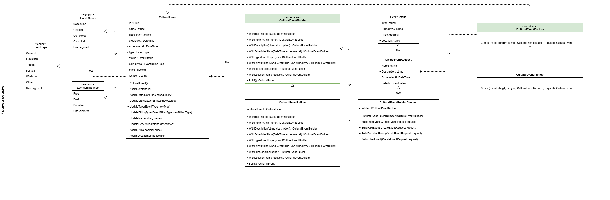
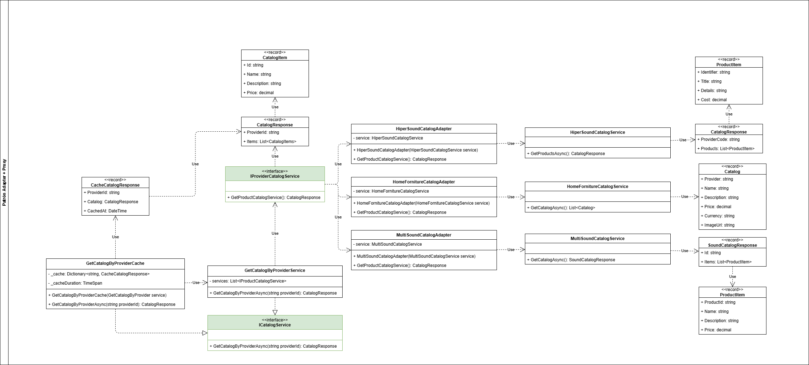
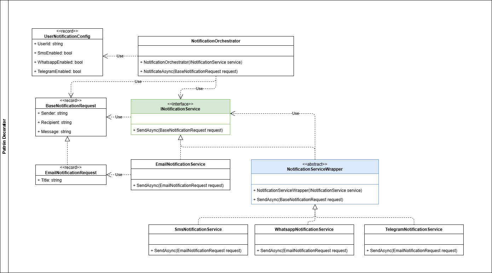
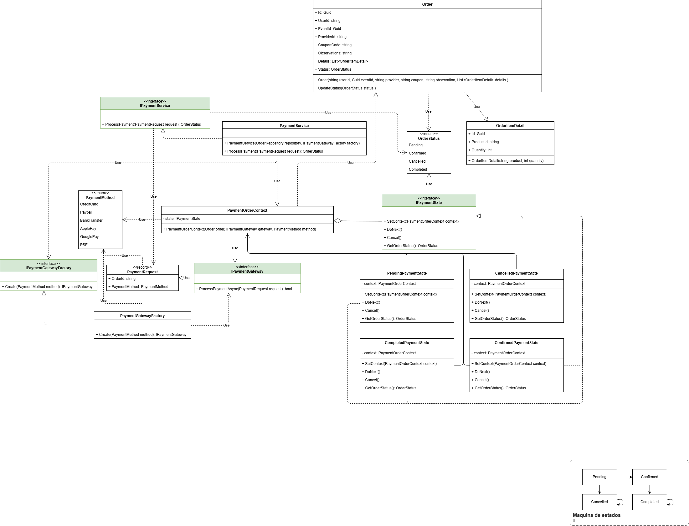

# Aplicación de patrones de diseño

En esta sección se describen los patrones de diseño que se han aplicado en el proyecto, así como las razones por las cuales se han elegido dichos patrones y cómo se han implementado en el código.

## Patrones de diseño creacionales aplicados

- **Builder**: El patrón Builder se ha aplicado dentro del desarrollo para la construcción del objeto `CulturalEvent`, el cual tiene una gran cantidad de propiedades, algunas de las cuales son opcionales. El uso del patrón Builder permite una construcción más flexible y legible del objeto, evitando la necesidad de tener múltiples constructores o un constructor con una gran cantidad de parámetros.

- **Factory Method**: El patrón Factory Method se ha utilizado para la creación de eventos dependiendo del tipo de facturación que este asociado. Esto permite encapsular la lógica de creación de eventos y facilita la extensión del sistema para soportar nuevos tipos de eventos en el futuro sin modificar el código existente.

## Patrones de diseño estructurales aplicados

- **Adapter**: El patrón Adapter se aplicó para adecuar los catalogos de cada proveedor a una interfaz común que el sistema pueda utilizar. Esto permite que el sistema pueda interactuar con diferentes proveedores sin necesidad de modificar su código, ya que cada proveedor se adapta a la interfaz común mediante un adaptador.

- **Decorator**: El patrón Decorator se ha utilizado para el envío de notificaciones basado en las preferencias del usuario. Este patrón permite agregar funcionalidades adicionales al sistema de notificaciones sin modificar el código existente, lo que facilita la extensión del sistema para soportar nuevas formas de notificación en el futuro.

- **Proxy**: El patrón Proxy se utilizó para cachear los catalogos de cada proveedor por un tiempo determinado, evitando así realizar múltiples llamadas a los proveedores para obtener el mismo catálogo. Esto mejora el rendimiento del sistema al reducir la cantidad de llamadas a los proveedores y permite una gestión más eficiente de los recursos.

## Patrones de diseño de comportamiento aplicados

- **Mediator**: El patrón mediador se utilizó para orquestar el proceso de creación de una orden de pedido, desde la selección de eventos hasta el pago y la generación de la orden. El mediador actúa como un intermediario entre los diferentes componentes del sistema, facilitando la comunicación y coordinación entre ellos sin que tengan que referenciarse directamente. Esto mejora la modularidad del sistema y facilita la gestión de las dependencias entre los componentes.

- **State**: El patrón State se aplicó para gestionar los estados internos que puede tener el pago de una orden de pedido, como "Pendiente", "Procesando", "Completado" o "Fallido". Este patrón permite que el comportamiento del sistema cambie dinámicamente según el estado actual del pago, lo que facilita la gestión de las transiciones entre estados y mejora la claridad del código.

- **Strategy**: El patrón Strategy se utilizó para implementar diferentes estrategias de pago, como "Tarjeta de crédito", "PayPal" o "Transferencia bancaria". Este patrón permite que el sistema seleccione la estrategia de pago adecuada en tiempo de ejecución, lo que facilita la extensión del sistema para soportar nuevas formas de pago en el futuro sin modificar el código existente.

